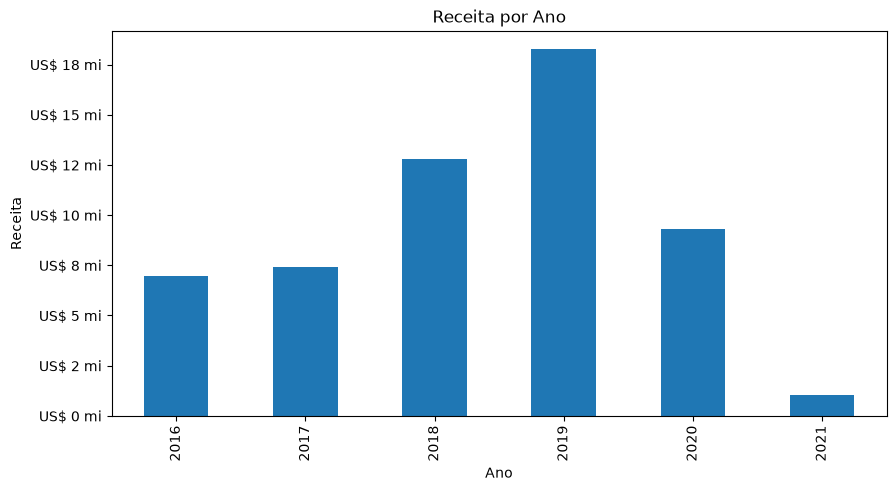
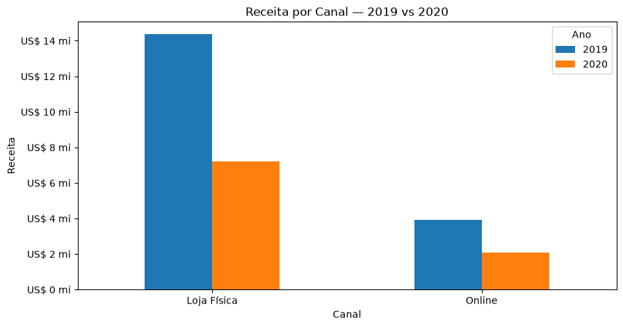
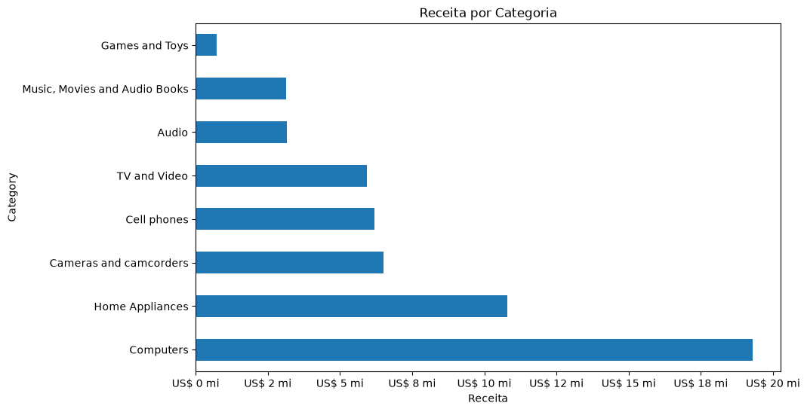
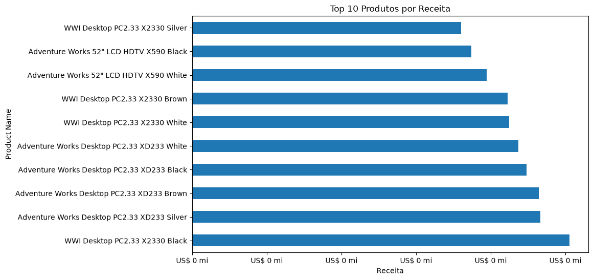
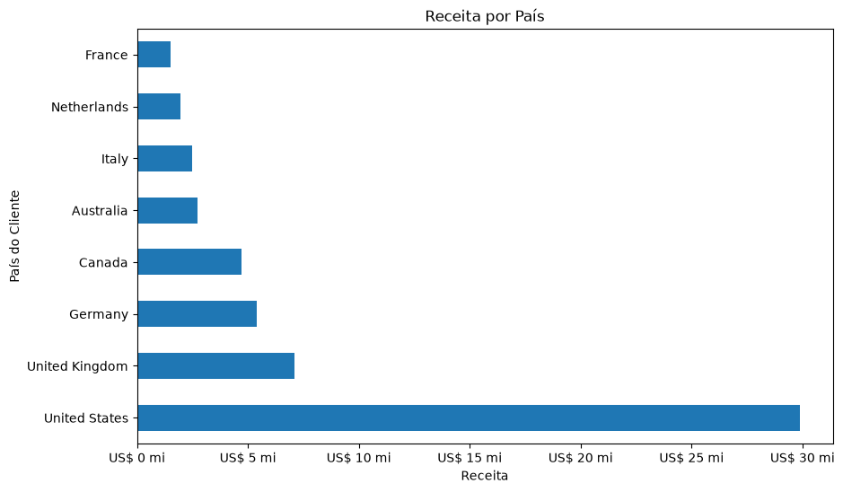
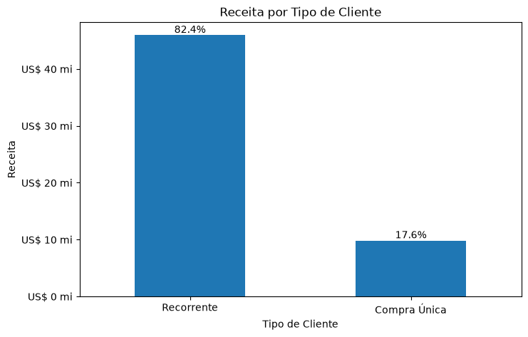

# Sales Analytics

## 🎯 Objetivo

Este projeto tem como objetivo analisar os dados de vendas de uma rede de lojas, buscando entender o desempenho comercial ao longo do período analisado e identificar padrões relacionados à receita, pedidos, produtos, categorias, canais de venda, localização dos clientes e comportamento de compra.

A análise foi desenvolvida utilizando Python e Pandas, com foco na exploração dos dados, criação de métricas, identificação de padrões e transformação dos resultados em insights que possam apoiar a tomada de decisões de negócio.

---

## 📊 Sobre os dados

O projeto utiliza dados relacionados às operações de vendas de uma rede de lojas.

Foram utilizadas diferentes fontes de dados:

- **Customers** — informações dos clientes;
- **Products** — informações dos produtos, categorias, custos e preços;
- **Sales** — registros das vendas e pedidos;
- **Stores** — informações das lojas;
- **Exchange Rates** — taxas de câmbio utilizadas para conversão dos valores.

As diferentes tabelas foram integradas para construir uma base analítica única, permitindo realizar análises combinando informações de vendas, clientes, produtos e lojas.

---

## 🔧 Tratamento dos dados

Durante a preparação dos dados foram realizados tratamentos como:

- Ajuste dos tipos de dados;
- Tratamento de problemas de codificação dos arquivos;
- Conversão de valores monetários;
- Conversão de datas;
- Integração das diferentes tabelas;
- Criação de métricas de receita, custo e lucro;
- Identificação dos canais de venda;
- Investigação de valores nulos;
- Criação de classificações para análise dos clientes e produtos.

### Valores nulos

Durante a análise da coluna `Delivery Date`, foram encontrados valores nulos.

Inicialmente, esses valores poderiam indicar um problema de qualidade dos dados. Porém, após investigar sua distribuição e relação com os canais de venda, foi possível identificar que os valores nulos estavam relacionados às vendas realizadas em lojas físicas.

As vendas online apresentavam informações de data de entrega, enquanto as vendas realizadas em lojas físicas não possuíam essa informação.

> **Insight:** Nem todo valor nulo representa um problema de qualidade dos dados. É importante investigar o contexto antes de decidir como tratar uma informação ausente.

---

# 🔎 Análises realizadas

## 📈 Evolução da receita

A receita apresentou crescimento entre 2016 e 2019, atingindo aproximadamente **US$ 18,26 milhões em 2019**.

Em 2020, houve uma queda de aproximadamente **49%**, com a receita passando para **US$ 9,29 milhões**.

### Gráfico



> **Insight:** A queda significativa da receita em 2020 motivou uma investigação mais detalhada sobre pedidos, clientes e comportamento de compra.

> **Observação:** Os dados de 2021 aparentam representar um período incompleto e, por isso, não foram utilizados para comparações anuais completas.

---

## 🏪 Desempenho por canal

A análise dos canais de venda mostrou uma queda semelhante entre 2019 e 2020:

| Canal | Variação da receita |
|---|---:|
| Loja Física | -49,67% |
| Online | -47,04% |

### Gráfico



> **Insight:** A queda ocorreu de forma semelhante nos dois canais. Isso indica que a redução não esteve associada exclusivamente ao desempenho das lojas físicas, já que o canal online também apresentou uma redução significativa.

---

## 📦 Pedidos e comportamento de compra

O número de pedidos caiu de **9.083 em 2019 para 4.635 em 2020**, uma redução de aproximadamente **49%**.

Ao investigar os componentes desse resultado, encontramos:

| Indicador | 2019 | 2020 | Variação |
|---|---:|---:|---:|
| Pedidos | 9.083 | 4.635 | -48,97% |
| Clientes ativos | 6.497 | 3.868 | -40,46% |
| Pedidos por cliente | 1,40 | 1,20 | -14,29% |
| Ticket médio | US$ 2.010,83 | US$ 2.005,31 | -0,27% |
| Itens por pedido | 7,53 | 7,44 | -1,32% |

> **Insight:** A redução dos pedidos esteve associada principalmente à diminuição do número de clientes ativos e à redução da frequência de compra. Enquanto isso, o ticket médio e a quantidade de itens por pedido permaneceram relativamente estáveis.

A relação entre esses indicadores pode ser representada por:

**Pedidos = Clientes ativos × Pedidos por cliente**

Essa decomposição reproduz matematicamente a queda observada no número de pedidos.

---

# 🏷️ Desempenho por categoria

As categorias com maior participação na receita foram:

- **Computers:** US$ 19,30 milhões — 34,62%;
- **Home Appliances:** US$ 10,80 milhões — 19,36%.

Juntas, essas categorias representam aproximadamente **54% da receita**.

### Gráfico



> **Insight:** A receita apresenta concentração relevante em algumas categorias, principalmente Computers e Home Appliances.

### Receita × rentabilidade

Apesar de Computers apresentar a maior receita e o maior lucro absoluto, não possui a maior margem percentual.

As margens das categorias ficaram aproximadamente entre **54,7% e 61,0%**.

> **Insight:** Maior faturamento não significa necessariamente maior rentabilidade percentual. A margem das categorias apresentou diferenças relativamente pequenas, apesar das diferenças de receita e lucro absoluto.

---

# 🛍️ Análise de produtos

Os produtos com maior receita foram predominantemente modelos de **Desktop PCs**, seguidos por alguns produtos de TV e vídeo.

### Gráfico



> **Insight:** A predominância de computadores entre os produtos de maior receita está alinhada ao destaque da categoria Computers no faturamento total e reforça a importância dessa categoria para o desempenho comercial.

### Distribuição das margens

Também foi analisada a distribuição das margens dos produtos por categoria.

> **Insight:** Games and Toys e Home Appliances apresentam maior concentração de produtos na faixa de margem baixa, enquanto Cameras and camcorders e Music, Movies and Audio Books apresentam maior proporção de produtos na faixa de margem alta.

> **Observação:** As faixas de margem utilizadas nessa análise foram definidas como uma classificação exploratória e não representam categorias oficiais da empresa.

---

# 🌎 Análise geográfica

Os Estados Unidos apresentaram:

- **53,58% da receita**;
- **48,00% dos clientes**;
- **US$ 5.235 de receita média por cliente**;
- **2,49 pedidos por cliente**.

### Gráfico



> **Insight:** Os Estados Unidos representam mais da metade da receita total e apresentam a maior frequência média de compra. A maior receita por cliente está associada principalmente à frequência de compra, e não ao maior ticket médio.

A análise também mostrou diferenças entre os mercados.

A Austrália, por exemplo, apresentou o **maior ticket médio**, mas uma das menores frequências de compra.

> **Insight:** Os diferentes mercados apresentam comportamentos de compra distintos, mostrando que receita por cliente, frequência e ticket médio precisam ser analisados em conjunto.

---

# 👥 Análise de clientes

Foram identificados **11.887 clientes**.

Os 10 maiores clientes representam apenas **0,76% da receita total**.

> **Insight:** Apesar da existência de clientes de alto valor, a receita não depende de um grupo extremamente pequeno de clientes.

Por outro lado, os aproximadamente **10% de clientes com maior receita representam 35,96% do faturamento**.

> **Insight:** Existe uma concentração relevante entre os clientes de maior valor, mas ela não é extrema, já que a maior parte da receita continua distribuída entre os demais clientes.

---

## 🔄 Clientes recorrentes × compra única

A análise classificou os clientes de acordo com o número de pedidos realizados.

| Tipo de cliente | Clientes | % da base | Receita | % da receita |
|---|---:|---:|---:|---:|
| Recorrente | 7.272 | 61,18% | US$ 45,94 mi | 82,39% |
| Compra Única | 4.615 | 38,82% | US$ 9,82 mi | 17,61% |

### Gráfico



A receita média por cliente foi:

- **Recorrente:** US$ 6.316,84;
- **Compra única:** US$ 2.127,71.

> **Insight:** Clientes recorrentes representam 61,18% da base, mas são responsáveis por 82,39% da receita. Em média, um cliente recorrente gera aproximadamente **2,97 vezes mais receita** que um cliente de compra única.

---

# 📊 Dashboard

O projeto também conta com um dashboard desenvolvido em **Streamlit**, criado para apresentar de forma visual os principais resultados encontrados durante a análise.

O dashboard reúne indicadores e visualizações sobre:

- Evolução da receita;
- Desempenho dos canais físico e online;
- Receita por categoria;
- Receita por país;
- Comportamento dos clientes;
- Top 10 produtos por receita;
- Principais insights da análise.

---

# 💡 Principais Insights

1. A receita caiu aproximadamente **49% em 2020** em relação a 2019.
2. A queda ocorreu de forma semelhante nos canais físico e online.
3. A redução da receita esteve associada principalmente à queda no número de pedidos.
4. A redução dos pedidos esteve associada à diminuição de clientes ativos e da frequência de compra.
5. O ticket médio e a quantidade de itens por pedido permaneceram relativamente estáveis.
6. **Computers e Home Appliances representam aproximadamente 54% da receita.**
7. Maior receita não significa necessariamente maior margem percentual.
8. Os Estados Unidos representam **53,58% da receita** e possuem a maior frequência média de compra.
9. Os 10 maiores clientes representam apenas **0,76% da receita**, indicando baixa dependência de poucos clientes.
10. Os aproximadamente 10% maiores clientes representam **35,96% da receita**.
11. Clientes recorrentes representam **82,39% da receita**, apesar de serem 61,18% da base.
12. Clientes recorrentes apresentam receita média aproximadamente **2,97 vezes maior**.
13. Existem diferenças relevantes no perfil de compra entre os países.
14. A análise dos valores nulos mostrou que **um valor ausente nem sempre representa um erro nos dados**.

---

# 📌 Recomendações

Com base nos resultados encontrados, algumas oportunidades podem ser destacadas.

### 1. Acompanhar a recorrência dos clientes

Como clientes recorrentes representam **82,39% da receita**, acompanhar indicadores relacionados à frequência de compra pode ajudar a entender e preservar esse comportamento.

### 2. Investigar a redução de clientes e frequência observada em 2020

A queda de clientes ativos e de pedidos por cliente foi um dos principais componentes da redução dos pedidos. Uma investigação mais aprofundada sobre esse comportamento pode ajudar a entender quais segmentos foram mais afetados.

### 3. Avaliar o desempenho das categorias considerando receita e margem

Computers possui grande importância para a receita, enquanto outras categorias apresentam margens superiores. Analisar essas duas dimensões conjuntamente pode ajudar a identificar oportunidades de equilíbrio entre volume e rentabilidade.

---

# 🏁 Conclusão

A análise dos dados de vendas permitiu identificar padrões importantes relacionados ao desempenho comercial, comportamento dos clientes, produtos, categorias e mercados.

O principal destaque foi a queda de aproximadamente **49% na receita em 2020**. A investigação mostrou que essa redução esteve associada principalmente à queda no número de pedidos, que por sua vez esteve relacionada à diminuição de clientes ativos e da frequência de compra. Ao mesmo tempo, o ticket médio e a quantidade de itens por pedido permaneceram relativamente estáveis.

A análise também mostrou uma concentração relevante da receita em determinadas categorias e no mercado dos Estados Unidos, além da forte participação dos clientes recorrentes no faturamento.

Outro ponto importante foi a análise da qualidade dos dados. A investigação dos valores nulos na data de entrega mostrou que a ausência da informação estava relacionada ao processo de vendas das lojas físicas, demonstrando que nem todo valor nulo representa necessariamente um problema.

Dessa forma, o projeto demonstra que a análise de dados vai além da criação de métricas. É necessário investigar os dados, validar hipóteses, entender o contexto do negócio e transformar os resultados encontrados em informações úteis para a tomada de decisão.

---

# 🛠️ Tecnologias utilizadas

- Python
- Pandas
- NumPy
- Matplotlib
- Streamlit
- SQL
- Git
- GitHub

---

# 📁 Estrutura do projeto

```text
sales-analytics/
│
├── analytics/
│   ├── analise.py
│   ├── carregamento.py
│   ├── exploracao.py
│   └── transformacao.py
│
├── data/
│   ├── dados_brutos/
│   │   ├── Customers.csv
│   │   ├── Data_Dictionary.csv
│   │   ├── Exchange_Rates.csv
│   │   ├── Products.csv
│   │   ├── Sales.csv
│   │   └── Stores.csv
│   │
│   └── dados_processados/
│       └── base_analitica.csv
│
├── visualizacoes/
│   ├── comparacao_canal_2019_2020.png
│   ├── receita_categoria.png
│   ├── receita_pais.png
│   ├── receita_por_ano.png
│   ├── receita_tipo_cliente.png
│   └── top_10_produtos_por_receita.png
│
├── .gitattributes
├── .gitignore
├── dashboard.py
└── README.md
├── requirements.txt